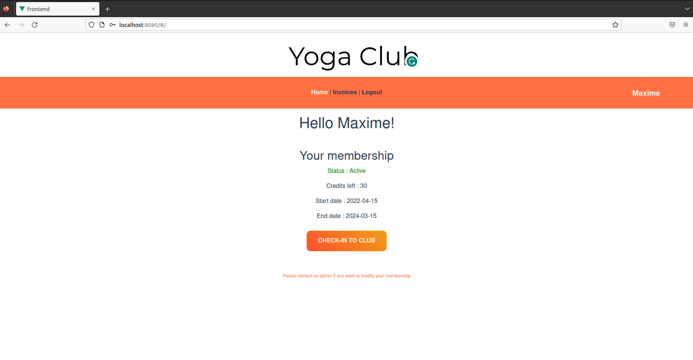
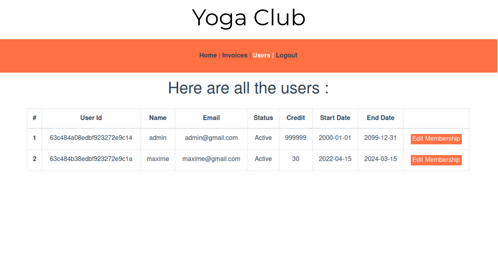
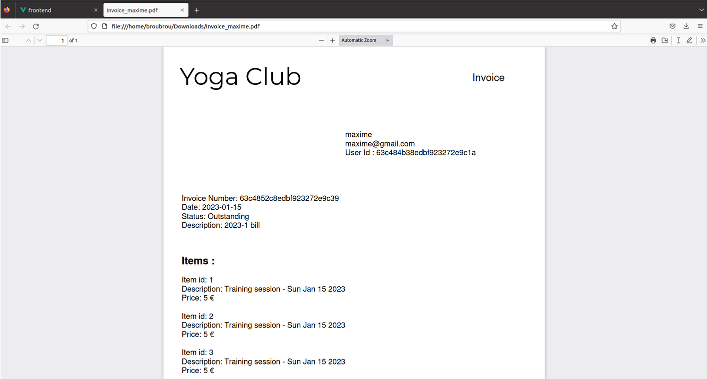

# A Yoga club web application for user and admin management

By Maxime Broussart

## Introduction

This project is a web application that allows users to **check-in** into a yoga club :
- Users can **log in** and **sign up** in total security (they get granted a JWT token).
- An admin account can **manage user memberships** (status, credits, start/end date).
- Users can have a look to their **invoices** and download them in PDF format.

## Stack

- mongoDB Atlas (cloud database)
- Node JS with express (back-end server)
- Vue JS (front-end framework)

## Preview

    

        
        
    

    

        
        
    

    Preview images

## Installation

1. clone the repository `git clone https://github.com/maxbroubrou/yoga-club-user-and-admin-web-application.git`
2. install the dependencies `make install`

## Run

Once launched, the application will be available at http://localhost:8081
- First, sign up an admin account with `admin@gmail.com` as email
- Then, you can sign up users account

### Run with Docker

- Build : `make build`
- Launch the docker-compose : `make launch`

### Run with Node JS

`make run` (this will run the front-end and the back-end)

To separately run the front-end or the back-end, use `make run-front` or `make run-back`

## API Documentation

The API documentation is available at http://127.0.0.1:3000/api-docs/ (the backend must be running).
The API documentation follow the OpenAPI 3.0.1 specification.

## Models

### User
- _id
- email
- name
- password

### Membership
- _id
- user_id (from User._id)
- active (this is a status)
- credits
- start_date
- end_date

### Invoice
- _id
- user_id (from User._id)
- year
- month
- date
- status
- description
- total_amount
- invoices_lines
    - item_id
    - description
    - amount

## TODO:

- Unit & Integration tests
